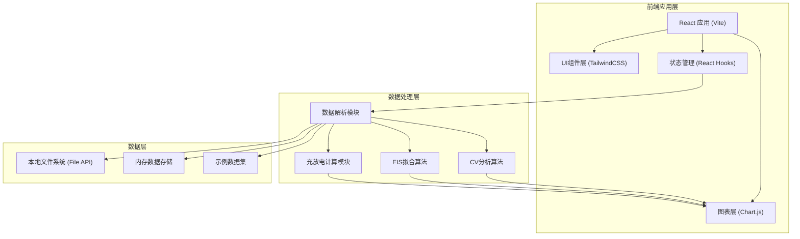

# 电化学测试数据分析工具 - 技术架构文档

## 1. 架构设计



## 2. 技术描述

- **前端框架**: React@18 + TypeScript
- **构建工具**: Vite@5
- **样式方案**: TailwindCSS@3
- **图表库**: Chart.js@4 + react-chartjs-2
- **数值计算**: 自定义算法 (Levenberg-Marquardt拟合)
- **状态管理**: React Hooks (useState, useContext)
- **后端**: 无后端，纯前端应用
- **数据库**: 无数据库，使用浏览器本地文件API

## 3. 路由定义

| 路由 | 页面 | 说明 |
|------|------|------|
| / | 首页 | 功能入口、快速上传、示例数据 |
| /cv | CV分析页 | 循环伏安数据分析、峰识别 |
| /eis | EIS分析页 | 阻抗谱分析、等效电路拟合 |
| /discharge | 充放电分析页 | 恒流充放电、容量计算、循环衰减 |
| /compare | 对比分析页 | 多条件数据横向对比 |

## 4. 核心模块设计

### 4.1 数据解析模块
- **功能**: 解析CSV/TXT格式电化学数据
- **支持格式**: 
  - CV数据: 电位(E/V)、电流(I/A或I/mA)、循环号
  - EIS数据: 频率(Hz)、实部(Z')、虚部(-Z'')
  - 充放电数据: 时间(t/s)、电压(V)、电流(A)、循环号
- **自动识别**: 根据列名和数据特征自动识别数据类型

### 4.2 CV分析算法
- **峰识别**: 基于二阶导数法识别氧化还原峰
- **峰参数**: 峰电流(Ip)、峰电位(Ep)、峰面积
- **基线校正**: 多项式拟合基线扣除
- **多循环对比**: 多组数据叠加展示

### 4.3 EIS拟合算法
- **等效电路模型**:
  - R(CR) - 简单RC电路
  - R(QR) - 常相位元件模型
  - R(Q(RW)) - Warburg扩散模型
  - R(Q(R(QR))) - 双时间常数模型
- **拟合方法**: Levenberg-Marquardt非线性最小二乘
- **拟合评估**: 卡方值、残差分析

### 4.4 充放电计算模块
- **容量计算**: 电流积分法 (Q = ∫I dt)
- **能量密度**: E = ∫V I dt / m
- **循环衰减**: 容量保持率计算
- **库仑效率**: 放电容量/充电容量 × 100%

## 5. 文件结构

```
src/
├── components/          # 可复用组件
│   ├── Navbar/         # 导航栏
│   ├── FileUpload/     # 文件上传组件
│   ├── ChartWrapper/   # 图表容器
│   ├── DataTable/      # 数据表格
│   └── ParamCard/      # 参数卡片
├── pages/              # 页面组件
│   ├── Home/           # 首页
│   ├── CVAnalysis/     # CV分析页
│   ├── EISAnalysis/    # EIS分析页
│   ├── Discharge/      # 充放电分析页
│   └── Compare/        # 对比分析页
├── utils/              # 工具函数
│   ├── parser/         # 数据解析
│   ├── cv/             # CV分析算法
│   ├── eis/            # EIS拟合算法
│   └── discharge/      # 充放电计算
├── data/               # 示例数据
├── hooks/              # 自定义Hooks
├── context/            # Context
├── types/              # TypeScript类型定义
└── App.tsx             # 主应用
```

## 6. 数据模型

### 6.1 数据类型定义

```typescript
// CV数据点
interface CVDataPoint {
  E: number;      // 电位 V
  I: number;      // 电流 A
  cycle: number;  // 循环号
}

// EIS数据点
interface EISDataPoint {
  freq: number;   // 频率 Hz
  Zreal: number;  // 实部 Ω
  Zimag: number;  // 虚部 Ω
}

// 充放电数据点
interface DischargeDataPoint {
  t: number;      // 时间 s
  V: number;      // 电压 V
  I: number;      // 电流 A
  cycle: number;  // 循环号
  type: 'charge' | 'discharge';
}

// CV峰参数
interface CVPeak {
  type: 'anodic' | 'cathodic';  // 氧化/还原峰
  Ep: number;     // 峰电位 V
  Ip: number;     // 峰电流 A
  area: number;   // 峰面积
  cycle: number;
}

// EIS拟合参数
interface EISFitParams {
  Rs: number;     // 溶液电阻 Ω
  Rct: number;    // 电荷转移电阻 Ω
  Cdl: number;    // 双电层电容 F
  W: number;      // Warburg系数
  n: number;      // CPE指数
  chiSq: number;  // 卡方值
  residuals: number[];
}

// 充放电计算结果
interface DischargeResult {
  capacity: number;       // 比容量 mAh/g
  energyDensity: number;  // 能量密度 Wh/kg
  coulombicEfficiency: number;  // 库仑效率 %
  cycleNumber: number;
}
```

## 7. 示例数据

提供多组示例数据用于演示：
- 不同扫描速率的CV数据
- 不同等效电路的EIS模拟数据
- 多循环充放电数据
- 不同温度/浓度的对比数据